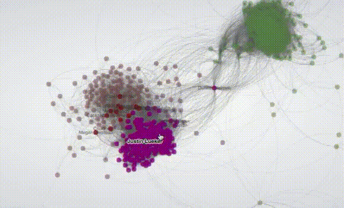

# Workflow #

Up to now, this repository will be public. At some level of analysis and data collected, it will become closed: some disclosure agreement must be accomplished!.

### What is this repository for? ###

* Quick summary
    * Strategies, policies, insights and _good practices_ on the mix of digital maps, cartography and data mining
    
	

### How do I get set up? ###

* Summary of set up
    * [Gephi](https://gephi.org/), [NetworkX](https://networkx.github.io/); [data mining](https://en.wikipedia.org/wiki/Data_mining), [Twitter API](https://dev.twitter.com/overview/api), [Heroku](https://www.heroku.com/), [Google Data Visualization API](https://developers.google.com/chart/interactive/docs/reference), [Openstreetmap API](http://wiki.openstreetmap.org/wiki/API_v0.7), [Google Maps API](https://developers.google.com/maps/documentation/javascript/tutorial?hl=es-419), Json (reader & editor), some (_essential_) Javascript libraries ([d3.js](https://d3js.org/), [Dc.js](https://github.com/dc-js/dc.js)), [QGis](http://www.qgis.org/en/site/) [plugins](https://plugins.qgis.org/): [CartoDB](https://github.com/gkudos/qgis-cartodb) (_et alia_), [R](https://cran.r-project.org/) (and various plugins), R Studio (and various plugins). List of webapps & API will grow...
* Configuration
    * Mostly done on MacOSX ~~ElCapitan~~ High Sierra environment. Minimally some process was done in a Windows system (virtualized, courtesy by VirtualBox). 
* Dependencies
    * _The less, the better_. Most time & effort is _done_ to avoid them.
* Database configuration
    * [OpenRefine](http://openrefine.org/), Neo4J (_plus_ plugins); [Firebase](https://firebase.google.com/); [Neo4J](https://neo4j.com/)
* How to run tests
    * Inner tests will be done. Datasets will not be released. _Law and privacy matters!_

### Contribution guidelines ###

* Write issues
    * No external issues allowed, because ome disclosure agreements must be accomplished!
* Code review
    * ~~Public Issue tracker disabled.~~
* Other guidelines
    * Not expected.

### Who do I talk to? ###

* Repo owner or admin
     - Contact `imhicihu` at `gmail` dot `com`     

### Code of Conduct

* Please, check our [Code of Conduct](https://bitbucket.org/imhicihu/digital-dy-spora/src/master/code_of_conduct.md)

### Legal ###

* All trademarks are the property of their respective owners.
